### What is Auto Scaling?

Auto Scaling is a cloud computing feature that automatically adjusts the number of compute resources (such as virtual machines) in a group based on real-time demand for applications. 

It is used to ensure that applications can handle varying workloads efficiently. 

### How to setup HA-SC with AWS

**Prerequisites:** <br>

Ensure you have a customized AMI that includes your application.

### Steps to set up Launch template: 

Launch template allows you to create a template that specifies the configurations for when making an instance e.g. specifies the AMI, instance type, security groups, key pair, and other instance details.


**Step 1:** Open the Amazon EC2 console, navigate to Instances, choose Launch Templates. Then Choose Create launch template.


**Step 2:** Create Launch template, fill out each required field, specifying your AMI, instance type, security groups, and other configurations.

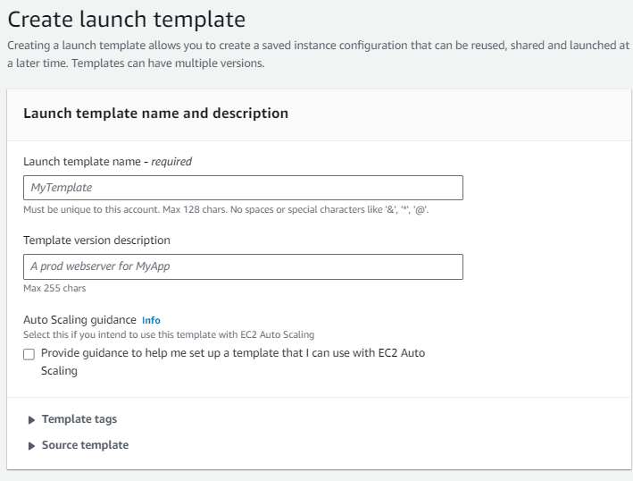

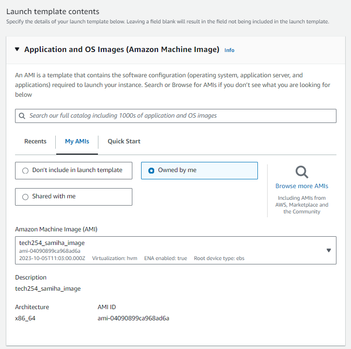

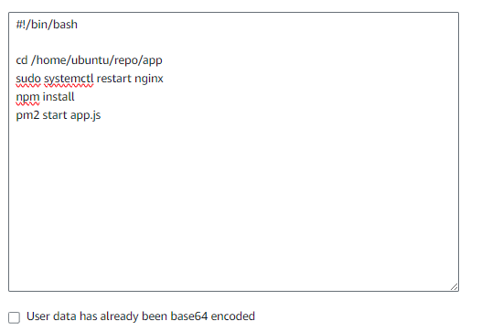

### Testing Launch template

**Step 3:** Open your launch template. Navigate to the Launch instances and select `launch instances`

- All configurations will have been prefilled in however, **it is important to add `resource tags`, then select `name` and enter a `value` name.** 
- We can now launch out instance to test if our app is running. 
- We can delete the instance after testing but ensure we keep the launch template. 

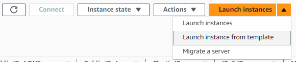

### Steps to Set Up Auto Scaling:

**Step 4**: After creating the launch configuration, go to EC2 -> Auto Scaling Groups.

select `Create Auto Scaling group`

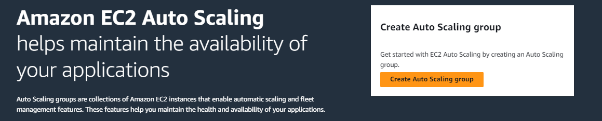

**Step 5:** Create a name for your auto scaling group and select the appropriate launch template that was created in step 2, then press `next`. 

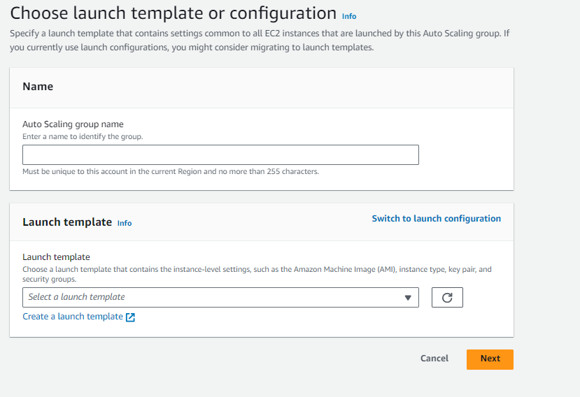

**Step 6:** Choose instance launch options 

- VPC remains the same
- select the appropriate `Availibility and subnets`

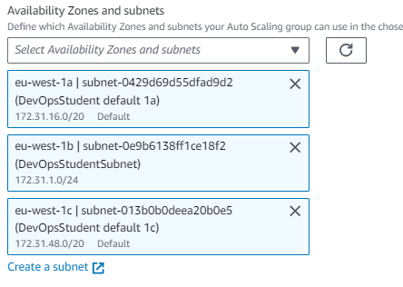

**Step 7:** Configure advanced options 

- Create a load balancer by clicking `attach to a new load balancer`

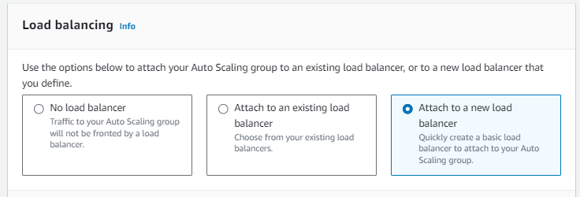

**Step 8:** Attach to a new load balancer 

- Select `Application Load Balancer`
- Create a `load balancer name`

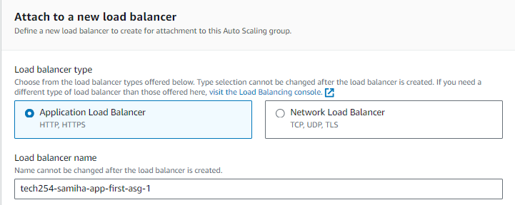

**Step 9:** Load balancer scheme

- Select `Internet-facing`

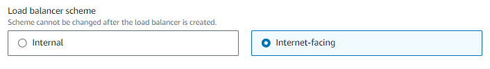

**Step 10:** Listening and Routing

- In default routing select `Create a target group`
- Create a new target group name 

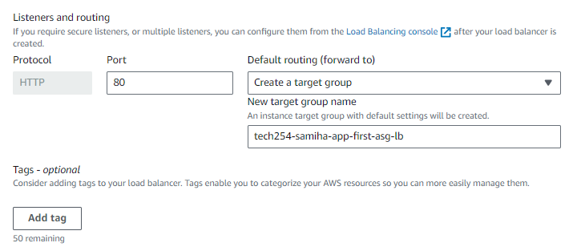

**Step 11:** Health Checks

- Check `Turn on Elastic Load Balancing`
- Leave everything else as default and press `next`

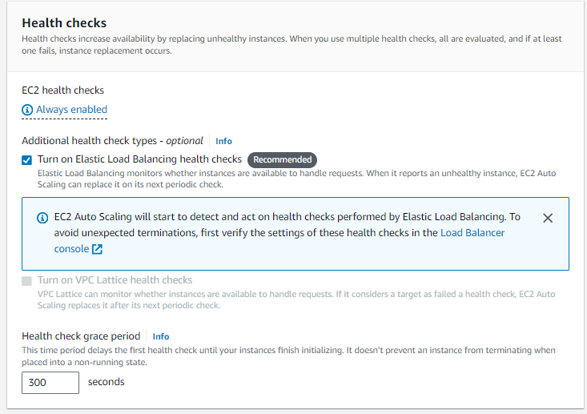

**Step 12**: Configure group size and scaling policies

- Change Group size settings to the following:

```
Desired capacity: 2
Minimum capacity: 2
Maximum capacity: 3
```
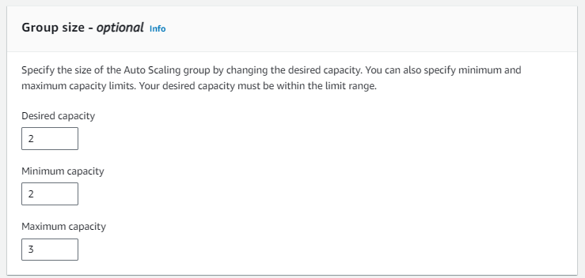

**Step 13:** Scaling policies 

- Select `Target tracking scaling policy`
- Keep everything else as default

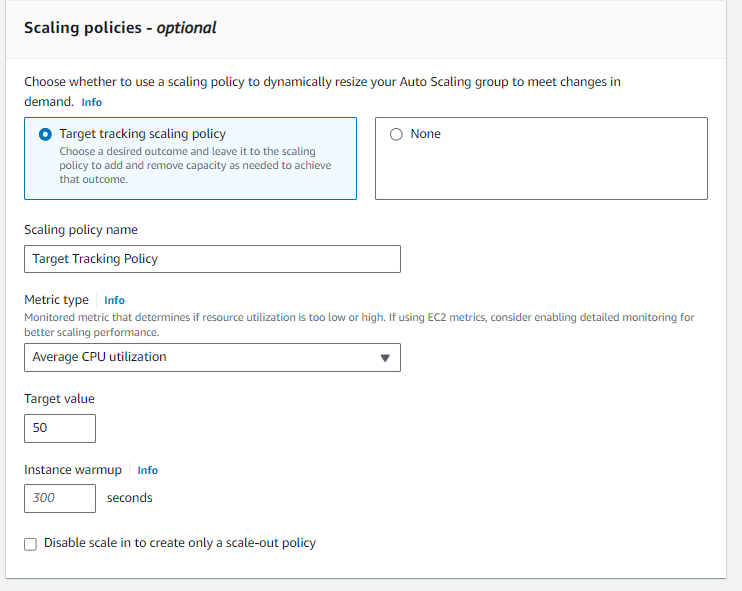

**Step 14:** Add notifications 

- Press `next`

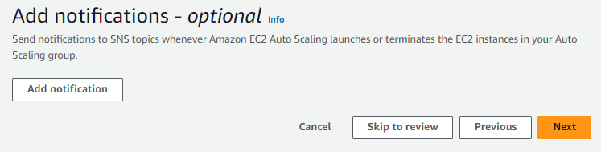

**Step 15:** Add tags

- Select `Add tag`
- Enter Key and Value 

```
Key: Name
Value: <enter any name>
```

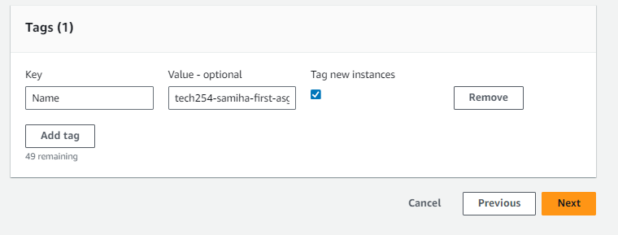

**Step 16:** Review

- Review all configurations and then create. Your Auto Scaling Group has now been created. 

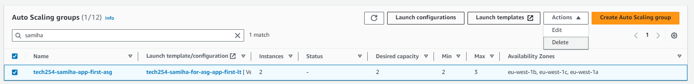

**Step 17:** Navigate to Load balancing. Click on the load balancer that you have created.

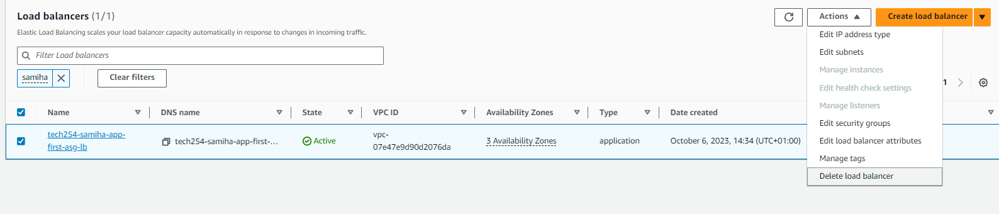

**Step 18:** Navigate to DNS name

- Copy and paste the DNS URL and run your application. You should also have two instances running on different availability zones. 

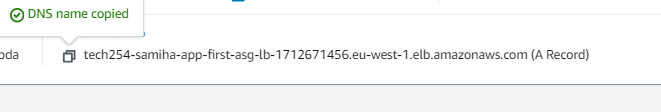

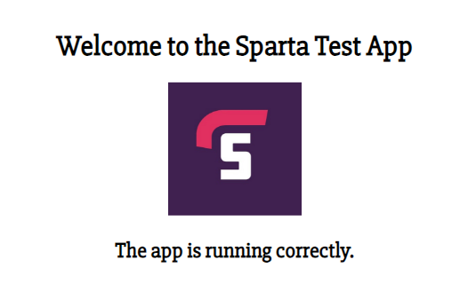

### How to stop an Auto Scaling Group

1. Delete the load balancer
2. Delete the target group
3. Delete the Auto Scaling Group

#### Diagram displaying worse to better solutions in preventing disasters 

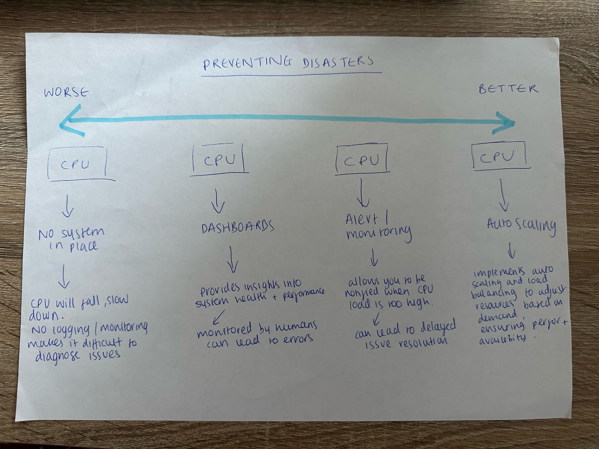