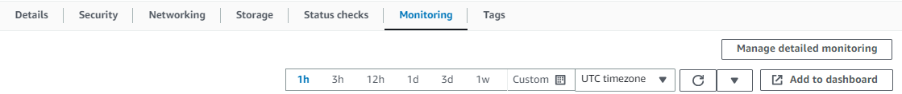
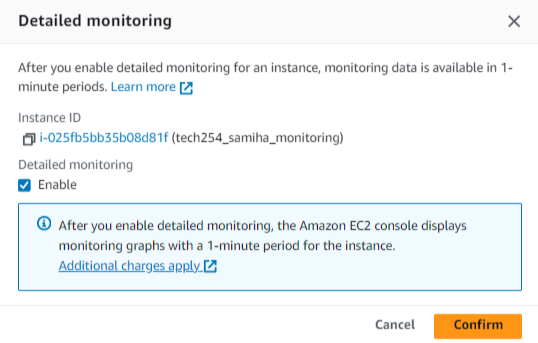
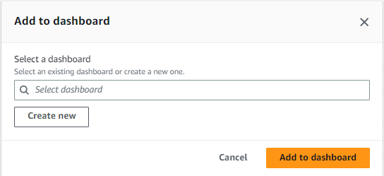

### Creating a Dashboard

Step 1: After launching your EC2 instance navigate to `monitoring`

Step 2: Click `mangae detailed monitoring`

Step 3: Click `enable`

Step 4: Click `Add to dashboard`

Step 5: Create a `new dashboard`

You have now created a dashboard for your EC2 instance. 

Step 6: name the dashboard 

Step 7: click add name, then `create`, then `add`