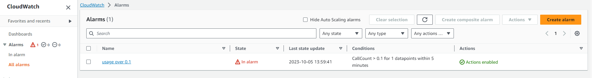
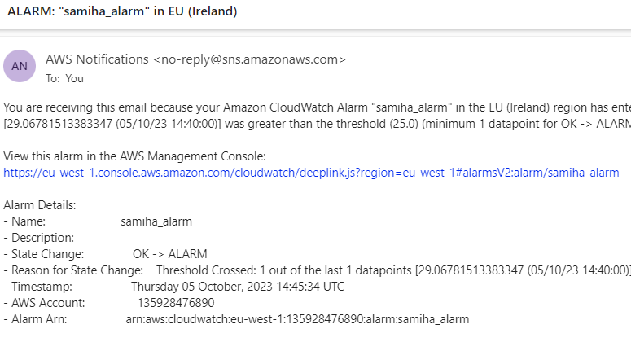

### Creating a CPU usage alarm 

**Step 1:** Open the CloudWatch console at https://console.aws.amazon.com/cloudwatch/.

**Step 2:** In the navigation pane, choose Alarms, All Alarms.

**Step 3:** Choose Create alarm.

**Step 4:** Choose Select metric.

**Step 5:** In the All metrics tab, choose EC2 metrics.

**Step 6:** Choose a metric category (for example, Per-Instance Metrics).

**Step 7:** Find your instance with the CPUUtilization in the Metric name column. 

**Step 8:** Under Specify metric and conditions, for Statistic choose Average

**Step 9:** Choose a period

**Step 10:** Under conditions, specify:
- Threshold type: static
- CPUUtilization: Greater than ... specify how much
- Additional configuration
- Missing data treatment

**Step 11:** Press next
**Step 12:** Under Notifications, select In alarm
**Step 13:** Create a topic with the email you would like to receive your alarm notifications. 
**Step 14:** Preview and create 

Your alarm has now been set up and you will receive a notification to your desired email if the CPUUtilization breaks the threshold. 

