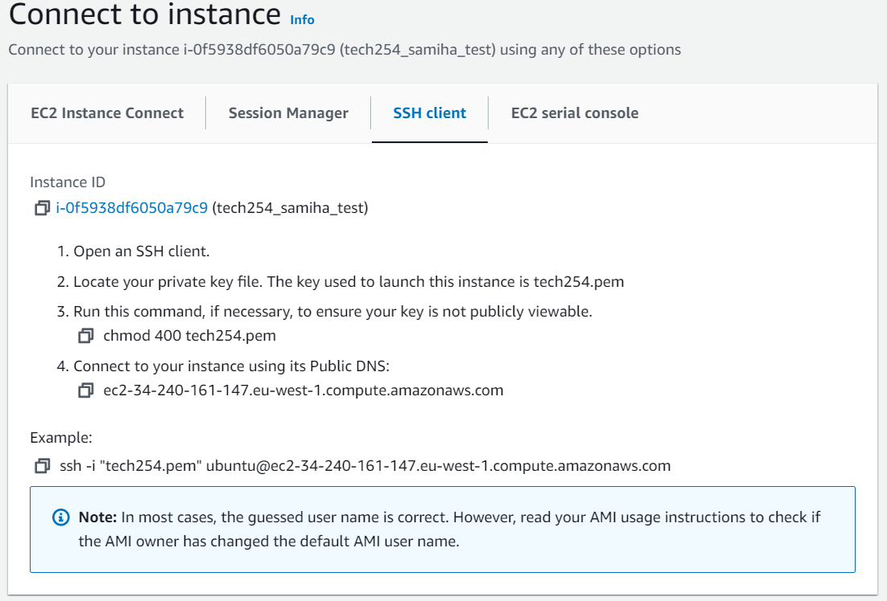

### Steps to Create an EC2 Instance
1. Sign in to the AWS Management Console
Go to the AWS Management Console and sign in with your AWS account credentials.


2. Navigate to Amazon EC2
Amazon Elastic Compute Cloud (EC2) is the AWS service for creating instances. Click on "Services" in the top-left corner, and then select "EC2" under the "Compute" section.


3. Launch an Instance in the EC2 Dashboard, click "Launch Instance."

#### Launching an Instance

1. create a name for the instance so that it can be easily identified. 


2. Select an AMI based on your requirements. You can choose from various operating systems and pre-configured software. 


3. Select an instance type based on your resource requirements (CPU, RAM, storage, etc.). AWS offers a variety of instance types optimized for different workloads.


4. Select the key pair


5. Configure Instance Details: Set options like the number of instances, network settings, and IAM roles if needed.


6. Configure Security Group: Create or select a security group to control inbound and outbound traffic to your instance.


7. Specify the size and type of storage (EBS volumes) for your instance.


8. Review your instance configuration and click "Launch."


### Deploying nginx webserver 

1. The instance has now successfully launched. We can now connect by pressing connect.


2. You will be then given a set of instructions to connect using SSH client..



3. You are now ready to open Gitbash terminal and login.


4. Open the terminal and enter the command `cd .ssh`


5. Enter the next command as instructed.


6. After following all instructions, you will now be logged in. 


7. Enter the following commands in the following order

```
sudo apt update
sudo apt upgrade -y
sudo apt install nginx -y
sudo systemctl start nginx
```

8. Return to your AWS instance page and you will be able to locate your public IP address and launch your nginx webserver. 


