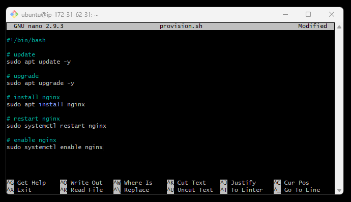

## Linux Notes

**MOVING FILES  **
`mv filename newfolder_name `

**MOVING FILES BACK**

`mv filename..`

RENAME FILE WITH MV - this renames chicken joke file 

`mv filename.txt newname.txt`

### Scripting with Linux and Running Scripts

1. Create `nano filename.sh`
2. This creates an inbuilt text editor. 

3. Inside the text editor we can begin writing our script. 

Enter the following in you editor 

5. Then save **(**control X, yes, enter)**
6. Use the sudo command `sudo chmod +x filename.sh` to allow you permission
7. `./ runfilename`
8. Your script will now be able to run.

### Processes

`ps` - allows you to see the user processes that you have been started
PID = refers to process ID
TTY = terminal 
CMD = was the cmnd used to start the process 

`ps --help simple` gives you basic commands that you can use 

`ps -A` this gives you all the processes that are going on 

`ps aux` this gives you all the process details and information. can be useful to identify a particular process you want to stop. 

`top` takes over shell and gives you a live read out of the processes that are running.

`kill -1 <PID name>` this kills the process 

`kill -15 <PID name>` this completely terminates the process 

`kill -9 <PID name>` very forceful way to terminate. Should only be used as a last resort. 

### Running a process

`sleep` allows you run a process in the foreground 
control z to exit

`sleep 5000 &` allows you to run in the background rather than foreground 

### Permissions

`ls -l`

3 different sets of permission for files and folders can be set
- owner: the owner has created the file
- group permissions: every file or folder belonds to a group
- others: anyone else who isnt the ownder or group

read access - can read only  
write access - you can change conetent  
excecute access - you can excecute the file  

`rwxrwxr-x`

`chmod [permissions] [file]` - allows you to change access to permissions  
`chmod u+x file_name` - changes for the owner  
`sudo chmod u+x file_name` use sudo if chmod doesn't work  
`chmod g+x file_name` allows the group to execute  
`chmod +x file_name` allows everyone to execute  

### short hand commands for access to permissions

`sudo chmod 777 filename` - gives acess too all 

You can use a chmod calcultor to find the number : https://chmod-calculator.com/

### Environment variables

`printenv` shows all the enviroment variables  
`printenv <select variable>` this will print out the contents of a particular variable. It is case sensitive. 

`MYNAME=Samiha` this is how a variable can be created 

`export MY_NAME=Samiha` 
`printenv `this will allow you to see your variable in the os itself 

### Copying files into EC2
`scp -i "<filepath to .pem file>" -r app ubuntu@ec2-3-250-0-59.eu-west-1.compute.amazonaws.com>`

`scp -i "C:/Users/Samiha/.ssh/tech254.pem" -r app ubuntu@ec2-34-242-237-25.eu-west-1.compute.amazonaws.com:~`

